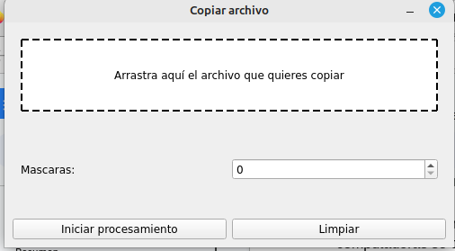

**Procesamiento Distribuido con Interfaz Gráfica**

***Descripción del experimento***

El propósito de este informe es documentar el experimento realizado
sobre el procesamiento distribuido con adición de una interfaz gráfica
desarrollada en Python. El objetivo principal del experimento fue
evaluar el desempeño de un conjunto de computadoras trabajando juntas en
una tarea compartida utilizando una interfaz gráfica para poder escoger
la imagen a procesar.

Para lograr esto, se desarrolló la interfaz usando el lenguaje de
programación Python utilizando la librería de PYUIC.

La tarea que se realizó con el procesamiento distribuido, fue dar un
efecto de desenfoque con 40 máscaras distintas, es decir, a 40 grados
diferentes de desenfoque. Para probar la eficiencia del procesamiento
distribuido, se le asignó cada máscara a un hilo de procesamiento
diferente. El código para realizarlo se escribió en C y se usó MPI para
distribuir las tareas entre los distintos hilos de procesamiento. Con
esta metodología, se analizará si se logró una asignación eficiente de
tareas y verificar que se haya logrado reducir el tiempo de
procesamiento significativamente.

***Condiciones de operación del experimento***

El programa recibió como entrada imágenes BMP de cualquier dimensión,
siempre y cuando cumplieran con los siguientes requisitos: formato BMP,
profundidad de bits de 24 y sin compresión. La salida del programa
generó una nueva imagen BMP con efecto de desenfoque.

Para llevar a cabo la ejecución del programa, se utilizaron los recursos
de tres computadoras conectadas en red.

**Computadora 1 (Master)**

-   Sistema operativo: Windows 10

-   Memoria RAM: 16GB

-   Procesador: Intel Core i5-10700K 3.80GHz

-   Máquina Virtual:

    -   Sistema Operativo: Linux Mint 21.1

    -   Memoria Base: 4096 MB

    -   Procesadores: 4 CPUs

**Computadora 2 (Slave)**

-   Sistema operativo: Windows 10

-   Memoria RAM: 8GB

-   Procesador: Intel(R) Core(TM) i5-8265U CPU 1.60GHz

-   Máquina Virtual:

    -   Sistema Operativo: Linux Mint 21.1

    -   Memoria Base: 4096 MB

    -   Procesadores: 3 CPUs

**Computadora 3 (Slave)**

-   Sistema operativo: Windows 10

-   Memoria RAM: 8GB

-   Procesador: Intel(R) Core(TM) i7-9750H CPU 2.60GHz

-   Máquina Virtual:

    -   Sistema Operativo: Linux Mint 21.1

    -   Memoria Base: 4212 MB

    -   Procesadores: 4 CPUs

Para el multiprocesamiento entre las tres computadoras, se emplearon las
siguientes librerías: nfs-kernel-server 2.6.1, openssh-server 8.9, gcc
11.3.0, mpiexec 4.1.2, mpich 4.1.2, pyuic.

Además, se configuraron las IPs estáticas IPV4 de cada computadora:
Ituriel con 192.168.1.5, Alejandro con 192.168.1.7 y Antonio con
192.168.1.6. Las tres computadoras se conectaron a la misma red LAN a
través de un switch para realizar la conexión entre ellas.

***Metodología***

Para instalar la libreria pyuic se utilizó el siguiente comando:

```
  pip install pyuic5-tool
```

También se utilizaron las librerías de openCV las cuales se instalan con
el siguiente comando:

```
  pip install opencv-python
```

Al momento de compilar la aplicación en el usuario mpiu se necesitó
realizar configuraciones con dicho usuario para poder utilizar el
display de la computadora y poder mostrar la ventana con la interfaz
gráfica.

Primeramente se utilizó el *comando xhost* + el cuál notifica al
servidor X de que cualquier aplicación que se esté ejecutando en
hostremoto tiene permiso para realizar peticiones a la misma.

Posteriormente una vez dentro del usuario MPIU se setéo la variable
DISPLAY con valor de :0, el cuál hace referencia al valor del Display de
la computadora.

Una vez que se realizó esto se pudo compilar la interfaz en usuario mpiu
y pode realizar el procesamiento distribuido

Para ejecutar el siguiente script de Python se utiliza el siguiente
comando:

```
  python3 script.py
```

Este comando mostrará la interfaz gráfica desarrollada con PyQt5:

{width="4.108982939632546in"
height="2.2656255468066493in"}

En esta interfaz se puede arrastrar una imagen y definir la cantidad de
máscaras para el programa. Esta interfaz copiará la imagen al directorio
/mirror para poder realizar el procesamiento de dicha imagen.

***Resultados***

Los resultados del experimento indicaron que el procesamiento
distribuido con la adición de una interfaz gráfica desarrollada en
Python fue efectivo en la tarea de aplicar el efecto de desenfoque a 40
imágenes diferentes utilizando 40 máscaras distintas.

La interfaz gráfica desarrollada nos permitió seleccionar fácilmente la
imagen que se debe procesar, lo que facilitó la tarea de administrar las
tareas de procesamiento. El uso de MPI para distribuir las tareas entre
los distintos hilos de procesamiento permitió una asignación eficiente
de tareas, lo que resultó en una reducción significativa del tiempo de
procesamiento en comparación con el procesamiento en una sola máquina.
Esto demuestra que el procesamiento distribuido y la interfaz gráfica
desarrollada en Python fueron eficaces para mejorar el rendimiento en la
tarea de aplicar el efecto de desenfoque a un conjunto de imágenes
utilizando múltiples máscaras.

***Conclusiones***

En conclusión, el uso de un procesamiento distribuido con una interfaz
gráfica desarrollada en Python es una estrategia efectiva para mejorar
significativamente el rendimiento en aplicaciones de procesamiento de
imágenes que requieren tareas intensivas en cómputo y procesamiento y la
experiencia de usuario.

La implementación de una estrategia de procesamiento distribuido con una
interfaz gráfica desarrollada en Python puede ser una herramienta muy
valiosa para la investigación y el desarrollo de aplicaciones de
procesamiento de imágenes. Esto puede llevar a una mayor eficiencia en
la gestión y procesamiento de datos, lo que a su vez puede reducir
significativamente los tiempos de procesamiento en comparación con los
métodos tradicionales.

En resumen, la combinación de procesamiento distribuido y una interfaz
gráfica desarrollada en Python puede ser una estrategia muy efectiva
para mejorar el rendimiento y la eficiencia en aplicaciones de
procesamiento de imágenes, lo que puede llevar a resultados más rápidos
y precisos en la investigación y el desarrollo de aplicaciones de
procesamiento de imágenes.
